# PULSE - a pendant to warn you when you touch your face
Here’s the tool and equipment list, materials, circuit diagram and assembly instructions. The ability to solder is necessary to assemble the PULSE pendant. Except for the IR sensor unit, the parts are generic and can be purchased broadly. Example links for purchasing these parts are shown.

### Table of Contents
* [Tools and equipment needed](https://github.com/nasa-jpl/Pulse#tools-and-equipment-needed)

* [Materials Required and links for ordering](https://github.com/nasa-jpl/Pulse#materials-required-and-links-for-ordering)

* [Pendant Case](https://github.com/nasa-jpl/Pulse#pendant-case)

* [Circuit Diagram](https://github.com/nasa-jpl/Pulse#circuit-diagram)

* [Assembly of the PULSE pendant](https://github.com/nasa-jpl/Pulse#assembly-of-the-pulse-pendant)

* [Acknowledgements](https://github.com/nasa-jpl/Pulse#acknowledgements)

* [In The Press](https://github.com/nasa-jpl/Pulse#In-The-Press)

* [Disclaimer](https://github.com/nasa-jpl/Pulse#disclaimer)

* [Contact Us](mailto:pulse@jpl.nasa.gov)

### Tools and equipment needed

1.	Home-class 3D Printer (PLA material or other as user option; you can also send files out for on-line order)

2. Soldering Iron and solder

3. Wire Stripper

4. Helping Hands Stand to Assist Soldering (optional)

### Materials Required and links for ordering

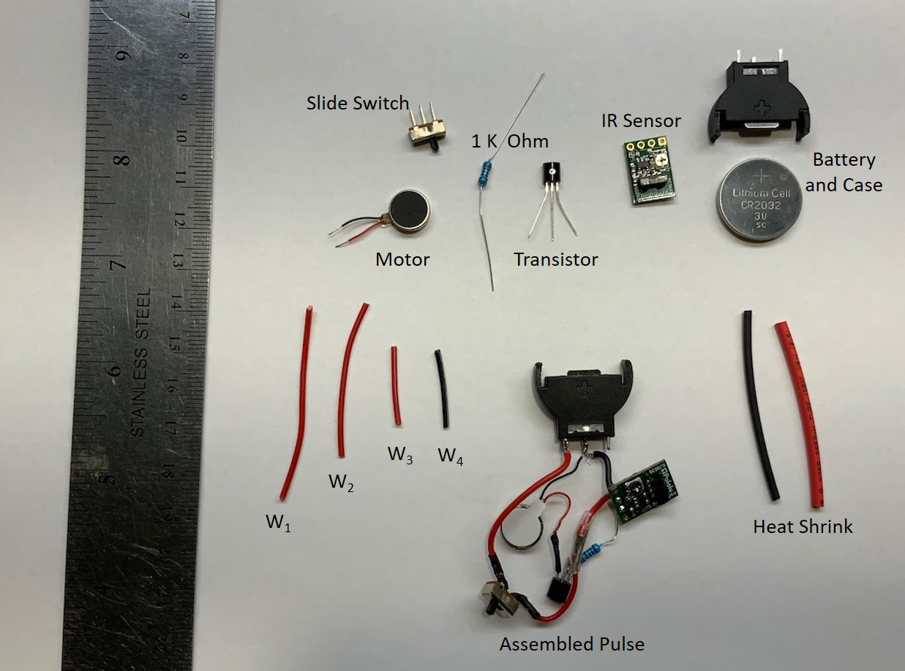

1. IR Sensor unit: Pololu 38 kHz IR Proximity Sensor [Order Here](https://www.pololu.com/product/2578)

2. PNP Transistor: 2N3906 or equivalent: [Order Here](https://www.amazon.com/Projects-B-0001-A10f-General-Transistor-92/dp/B07Y3GFR5P/ref=sr_1_6?dchild=1&keywords=2n3906+transistor&qid=1589929461&sr=8-6)

3. 1 K Ohm standard resistor: [Order Here](https://www.amazon.com/EDGELEC-Resistor-Tolerance-Resistance-Optional/dp/B07HDDWFDD?ref_=ast_slp_dp)

4. Slide Switch to fit case: [Order Here](https://www.amazon.com/gp/product/B07NLR444L/ref=ppx_yo_dt_b_asin_title_o06_s00?ie=UTF8&psc=1)

5. Vibrating Motor to fit case [Order 10x2.0mm Vibrating Motor Here](https://www.pololu.com/product/1638) or [Order 10x3.4mm Vibrating Motor Here](https://www.pololu.com/product/1636)

6. W1 – 5 cm; W2 – 4 cm; W3 – 2 cm; W4 – 2 cm; 22 Gage Wire

7. Heat shrink tubing to cover leads: [Order Here](https://www.amazon.com/560PCS-Heat-Shrink-Tubing-Eventronic/dp/B072PCQ2LW/ref=sr_1_5?dchild=1&keywords=shrink+wrap&qid=1589929721&s=industrial&sr=1-5)

8. Battery Holder: [Order Here](https://www.amazon.com/gp/product/B07FL8MFK8/ref=ppx_yo_dt_b_asin_title_o01_s01?ie=UTF8&psc=1)

9. 3V CR2032 Coin Battery: [Order Here](https://www.amazon.com/gp/product/B071D4DKTZ/ref=ppx_yo_dt_b_asin_title_o09_s01?ie=UTF8&psc=1)

10. Dark colored paint (i.e., acrylic, oil, nail polish etc.) such as black, navy blue, dark green, etc. (Required only when utilizing non-black colored case material)
 
### Pendant Case

The PULSE pendant case was designed to hold the existing parts. Other pendant designs can be created as desired as long as the IR sensor will fit and has a clear view to the front of the pendant.
 
If not using black material for case, the bottom of the IR emitter will need to be painted black or covered with black electrical tape to absorb any light. If this is not done, the sensor will read false motion and vibrate continuously. Only the flat bottom, do not cover the whole LED.

[Download STL Files](https://github.com/nasa-jpl/Pulse/tree/master/CAD)

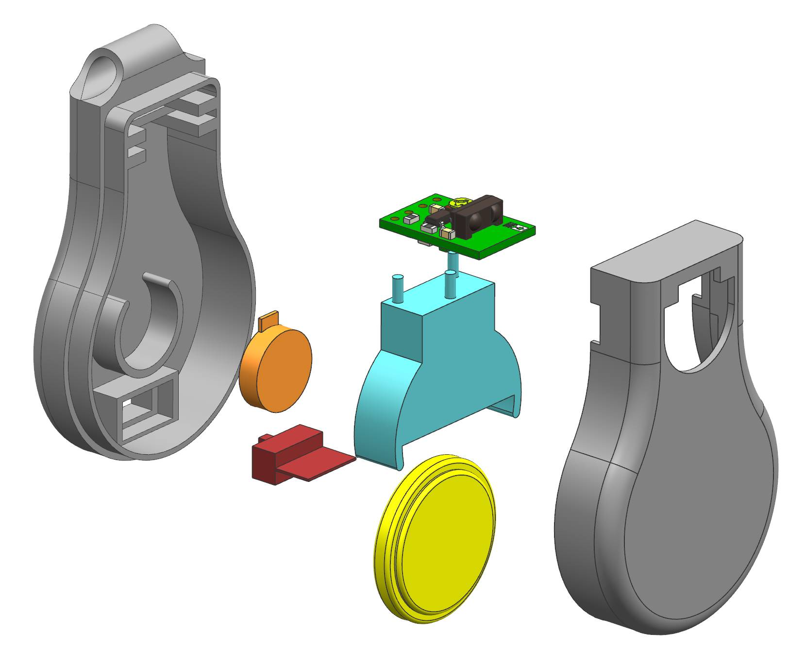

### Circuit Diagram

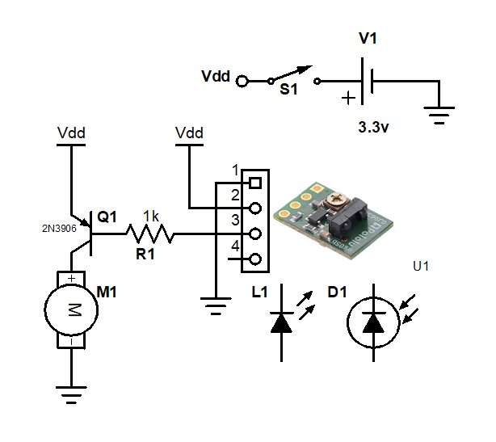

Central to the design of the PULSE pendant is the infrared sensor unit (U1 in the diagram) that provides a high (~3 V) output signal to pin 3 by default, and drops low (~1 V) when the LED detector (D1) receives a signal indicating your hand (or other reflecting object) is in front of the pendant.  L1 is the radiating infrared LED. When pin 3 goes low, it powers the PNP transistor (Q1) to energize the motor (M1) causing it to vibrate and the pendant to pulse. V1 is the 3 V battery in the case and S1 is the slide switch. Pin 4 on the infrared sensor is an enable input and is not used.

### Assembly of the PULSE pendant

1. Wire W1 solders to the center pin of the switch and wire W2 solders to an end pin of the switch. The third pin on the switch can be 		clipped off – it is not used. Heat shrink covers the pins. This picture shows the completed switch next to an assembled PULSE pendant

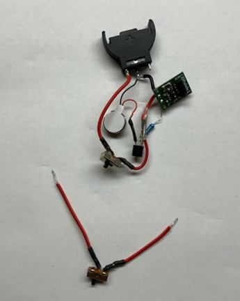

2. The other end of W2 solders to the emitter pin of the transistor as well as wire W3. (This is a three-way connection – wires W2, W3 		and the transistor emitter pin are connected together; this is the positive voltage). The picture shows the use of a helping hands to 	perform the soldering of three leads, and then the end result. Heat shrink is used to cover the lead at the transistor.

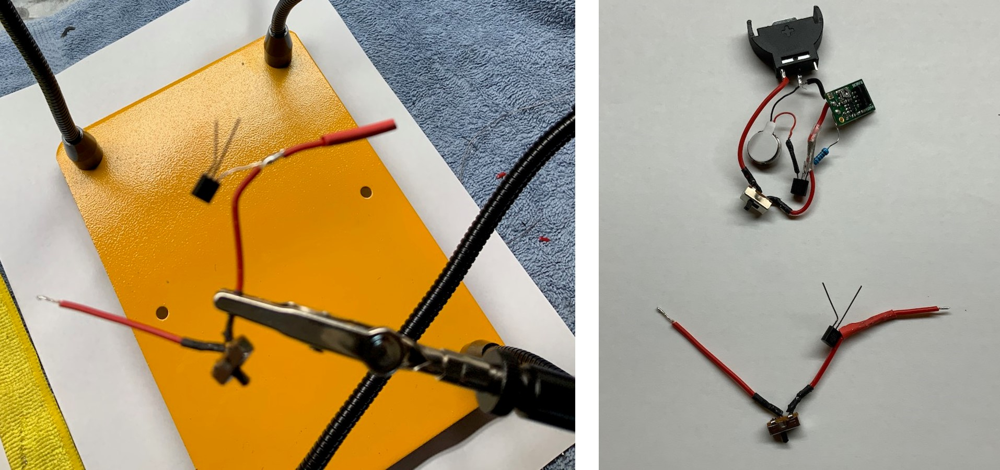

3. The other end of wire W3 then attaches to pin 2 of the IR sensor

4. Wire W4 (ground), attaches to pin 1 of the IR sensor

5. The 1 K Ohm standard resistor attaches to the middle or base pin of the transistor. Use heat shrink to cover the connection

6. The 1 K Ohm standard resistor attaches to pin 3 of the IR sensor. This picture shows the assembly so far

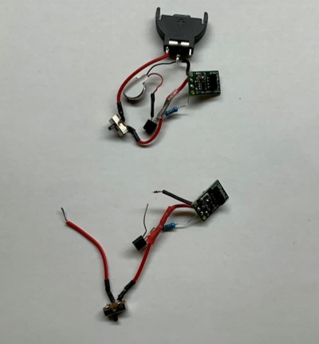

7. The red wire of the vibrating motor solders to the collector pin of the transistor. Use heat shrink to cover the connection

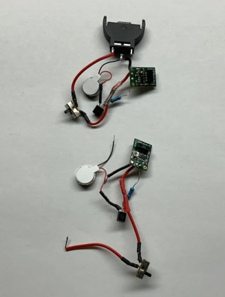

8. The black wire of the vibrating motor solders to the ground port of the battery case (jointly with W4). The other end of W1 solders 		to the positive pin of the battery holder. This picture shows the completed assembly and the wires folded for insertion into the 				bottom case

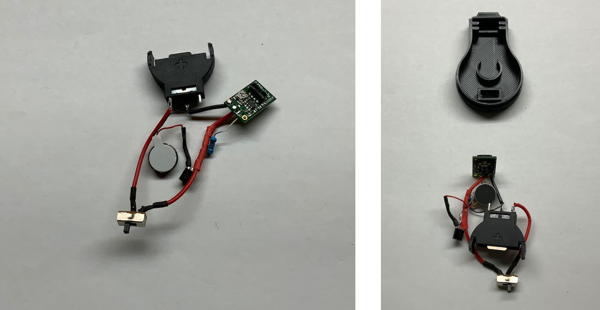

9. The motor and switch snap into the case base

10. The IR sensor slides into the case base rails

11. The electronics are gently tucked into the case base

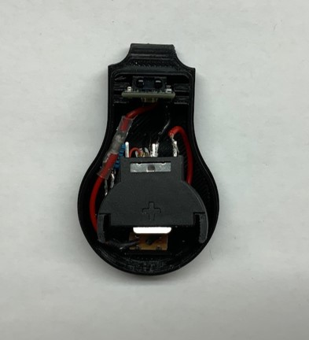

12. Using a dark colored paint (i.e., acrylic, oil, nail polish etc.) such as black, navy blue, dark green, etc., lightly paint over the 		emitter as shown in the image below. Using a dark colored pen or marker will not work the same as paint. 

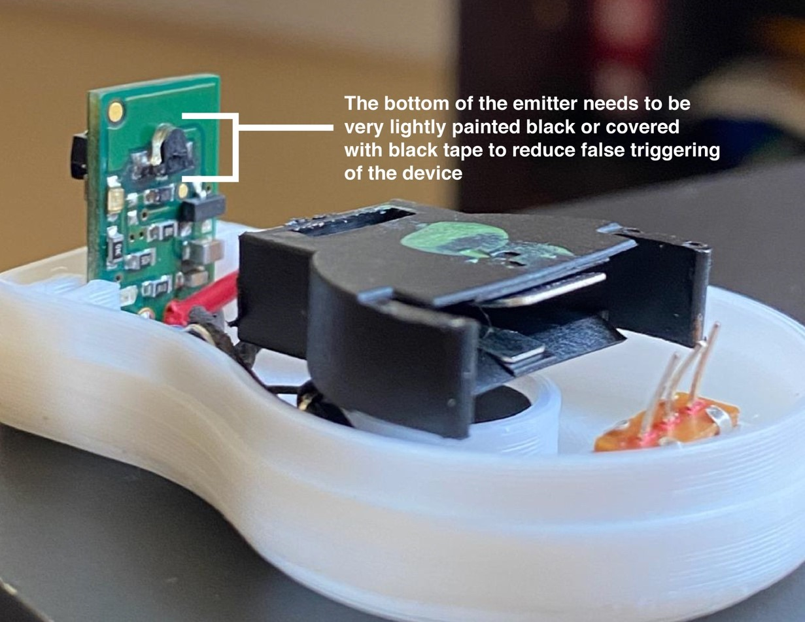

13. With the electronics in the case base, the battery can be installed, the switch can be set on; move your hand in front of the IR 				sensor and the red LED on the sensor board will light and the case will PULSE!  

[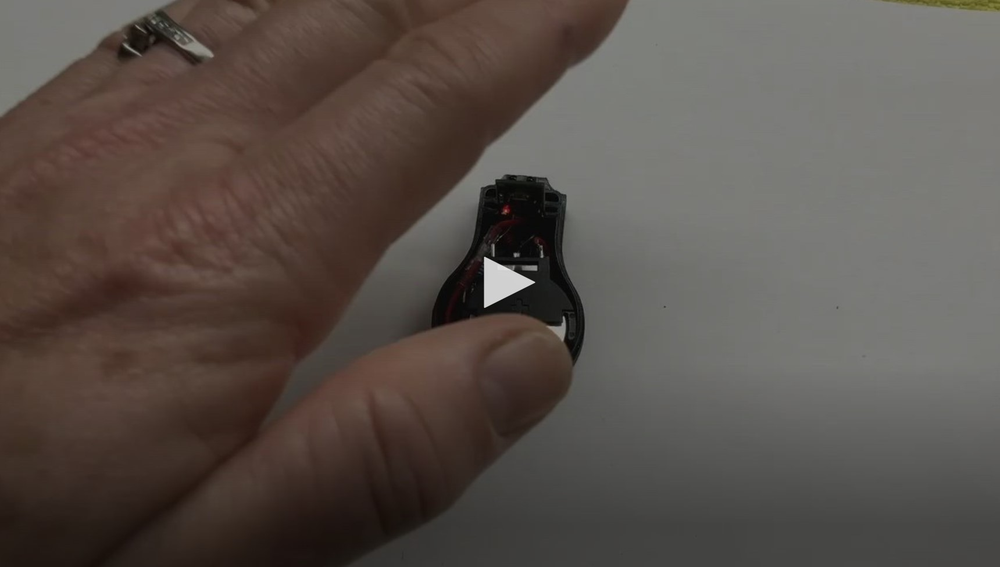](https://www.youtube.com/watch?v=7utCPXKdKHg&list=PLKWlaxzCh8uKqaNQIiBa6WjCEDBVH6ehV&index=3)

14. Install the top case. Attach a necklace of your choice and PULSE is complete

### Acknowledgements

In early March of 2020, it was becoming quite apparent that the pandemic has reached the United States. We, like so many other countries, would have to partake in precautionary methods to protect ourselves from contracting a novel virus that was affecting the world in unrecognizable ways.  

With little information available, we turned to the CDC for guidance. They provide the general public with a clear list of tasks to help prevent infection, one of which was advising us not to touch our faces. As the news unfolded and the warnings heightened, we found ourselves immersed in discussions related to the topic, most of which consisted of commiserating on the laborious task of not touching our face. During a Monday morning tag-up, and as our team members revealed how often they touch their face, [Tom Cwik](mailto:pulse@jpl.nasa.gov), the engineer, and [Faith Oftadeh](mailto:pulse@jpl.nasa.gov), the designer, suddenly realized that a simple wearable device may help with this problematic subconscious behavior. 

Immediately, we started pulling together a list of inexpensive and easily accessible parts, sketching out ideas, and once the concept seemed plausible, we agreed to pursue it all while JPL closed and transitioned to telework. Within days, we found ourselves adjusting to a new way of living. While working from home, managing childcare, and attempting to do “business as usual,” we continued developing PULSE via text and Facetime during the nights and weekends. When it came to creating a proper casing for the pendant, Dan Kolenz joined the team as the CAD mechanical designer. After prototyping and working through sluggish online parts ordering, coupled with frequent late-night texting, facetime sessions, and 3D printing in the garage, we managed to create an operating prototype.  

Dave Gallagher, JPL’s Associate Lab Director provided significant encouragement and JPL support to move forward. Rafael Martinez paved the way from within JPL to allow us to release PULSE and bring it to where it is today. Lisa Harbottle volunteered to demo and model the pendant, Gary Bolotin gave a review of the electronics, Kristy Kawasaki designed the website, and Olivia Cwik was key to soldering and added to the Readme.

Our goal was to create a simple device that can help minimize the spread of a virus. We also hope that the public can further develop this concept. As we return to our office spaces and attempt to integrate back into society, we believe that PULSE may help others stay as healthy as possible.

### In The Press

* Radio interview with KNX LA 1070 AM
* Featured on KTLA channel 5 morning news and ABC LA channel 7 June 30, 2020
* Live via zoom on Fox channel 26 Morning Show, Houston, Wednesday July 1, 2020

1. [Techcrunch](https://techcrunch.com/2020/06/25/nasas-jpl-open-sources-an-anti-face-touching-wearable-to-help-reduce-the-spread-of-covid-19/)
1. [USATODAY](https://www.usatoday.com/story/tech/2020/06/29/dont-touch-your-face-nasa-developed-necklace-remind-you/3277469001)
1. [Mashable](https://mashable.com/article/nasa-coronavirus-pulse-necklace/)
1. [Daily Mail](https://www.dailymail.co.uk/sciencetech/article-8472289/NASA-designs-necklace-simulates-nudge-person-attempts-touch-face.html)
1. [CNet](https://www.cnet.com/health/nasa-necklace-fights-coronavirus-by-reminding-you-not-to-touch-your-face/)
1. [UK News](https://uk.news.yahoo.com/nasas-jpl-open-sources-anti-214029542.html?guccounter=1)
1. [Engadget](https://www.engadget.com/nasa-coronavirus-covid-19-necklace-jpl-stop-touching-your-face-194312229.html)
1. [GovTech](https://www.govtech.com/question-of-the-day/Question-of-the-Day-for-06292020.html)
1. [SlashGear](https://www.slashgear.com/nasa-pulse-necklace-is-a-clever-diy-solution-to-prevent-face-touching-26626595/)
1. [TheDenverChannel](https://www.thedenverchannel.com/news/national/nasa-creates-pendant-to-remind-you-not-to-touch-your-face-amid-pandemic)
1. [TechTimes](https://www.techtimes.com/articles/250648/20200627/covid-19-cure-this-nasa-necklace-can-save-you-from-coronavirus-heres-how.htm)
1. [TrendHunter](https://www.trendhunter.com/trends/3d-printed-pendant-necklace)
1. [Cosmopolitan](https://www.cosmopolitan.in/life/features/a20612/nasa-designs-pulse-necklace-prevent-spread-coronavirus)
1. [Futurism](https://futurism.com/the-byte/nasa-wearable-scolds-touching-face)
1. [NewsMax](https://www.newsmax.com/health/health-news/nasa-pendant-pulse-touch/2020/06/29/id/974670/)
1. [Houston Chronicle](https://www.houstonchronicle.com/news/space/article/NASA-designed-pendant-vibrates-before-you-touch-15377186.php)
1. [MSN](https://www.msn.com/en-us/Health/wellness/coronavirus-nasa-invented-a-wearable-that-reminds-you-not-to-touch-your-face/ar-BB166pJT?ocid=a2hs)
1. [CoronaCOVID19](https://www.corona-covid19.be/world/corona-nasa-designed-a-vibrating-necklace-to-help-you-stop-touching-your-face/)
1. [PublicReleases](http://publicreleases.com/index.php/2020/06/26/to-help-reduce-the-spread-of-covid-19-nasas-jpl-creates-an-anti-face-touching-necklace/)
1. [PasadenaNow](https://www.pasadenanow.com/main/jpl-scientists-invent-necklace-to-help-combat-covid-19-give-away-blueprints/)
1. [NewsErector](https://www.newserector.com/nasa-introduced-a-necklace-which-warns-its-wearer-not-to-touch-their-face)
1. [InceptiveMind](https://www.inceptivemind.com/nasa-pulse-pendant-reminds-users-not-touch-faces/14071/)
1. [3DPrintingDesign](http://www.3dprintingdesign.es/en/new/a-3d-printed-necklace-that-prevents-you-from-touching-your-face)
1. [FirstPost](https://www.firstpost.com/tech/science/coronavirus-outbreak-nasa-develops-pulse-pendant-supposed-help-keep-hands-away-face-8540481.html)
1. [8NewsNow](https://www.8newsnow.com/news/local-news/nasa-wearable-necklace-reminds-you-not-to-touch-your-face/)
1. [Telecino](https://www.telecinco.es/informativos/tecnologia/colgante-disenado-nasa-evitar-tocarte-cara-contagio-coronavirus-be5ma_18_2971770181.html)
1. [Tivi (Finnish news)](https://www.tivi.fi/uutiset/nasan-keksinto-yrittaa-vahentaa-koronaviruksen-leviamista-kaulakoru-estaa-kasvojen-koskemisen/07645c61-0079-4207-91b9-3c09c1c00a36)

### Disclaimer

Disclaimer: The designs herein have not been reviewed, cleared, or approved by FDA or other regulatory authority, nor have they received Coronavirus Disease 2019 (COVID-19) Emergency Use Authorizations for Medical Devices. Neither California Institute of Technology (including the Jet Propulsion Laboratory)("Caltech") nor its employees or agents provide any representation or warranty, express or implied, for fitness for a particular purpose, safety, efficacy, or non-infringement of any third party intellectual property rights. Caltech offers these device designs in good faith to help healthcare providers and others prevent the spread of and treat patients with COVID-19. Physicians and other healthcare providers bear full responsibility to convey warnings and obtain patients' informed consent.

### [Contact Us](mailto:pulse@jpl.nasa.gov)

### The research was carried out at the Jet Propulsion Laboratory, California Institute of Technology, under a contract with the National Aeronautics and Space Administration.
